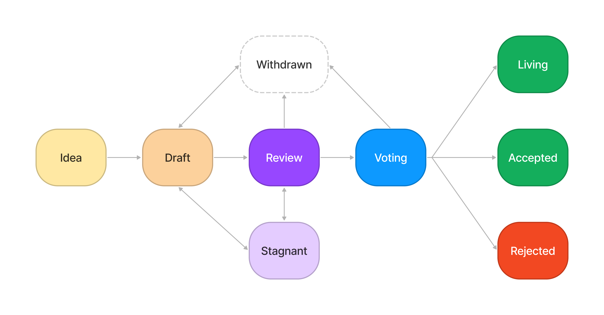

## What is a CIP?

CIP stands for Constellation DAO Improvement Proposal. A CIP is a design document providing information to Constellation DAO, or describing improvements or changes to DAO operations, and new efforts within its membership. The CIP should provide a concise description and rationale of the concept. The CIP author is responsible for building consensus within the DAO and documenting dissenting opinions.

## CIP Rationale

We intend CIPs to be the primary mechanisms for proposing new efforts, for collecting input on an issue, and for documenting the design decisions that go into Constellation DAO. Because the CIPs are maintained as text files in a versioned repository, their revision history is the historical record of the proposal.

## CIP Types

There are three types of CIPs:

- An **Operations CIP** describes any change that affects Constellation DAO operations, such as—changes to its `governance`, ideas for new `programs` or initiatives, or any change or addition that affects the DAO `treasury`. Operations CIPs consist of two parts—a design document and its implementation. Furthermore, Operations CIPs can be broken down into the following categories:
  - **Governance**: improvements or changes to the governance of Constellation DAO, including its charter, the proposal process, internal discussion, legal matters, and considerations relating to membership, conflicts of interest, ethical questions, and disagremeents.
  - **Programs**: includes improvements and changes to the DAO's software, tools, documentation. It also includes matters relating to the growth of the membership, including the development of programs and partnerships, as well as maintaining and safeguarding membership information.
  - **Treasury**: includes improvements or changes relating to the handling of the DAO's assets, its wallets, and the $CXN token
- A **CRC** (Constellation DAO Request for Comment): a document that describes matters that don't directly relate to governance, programs, or treasury, and otherwise may be standards and conventions to be adopted by the DAO.
- An **Informational CIP** provides general guidelines or information to the Constellation DAO membership, but does not propose a change to operations or activities. Informational CIPs do not necessarily represent consensus within the DAO, so members and are free to ignore Informational CIPs or follow their advice.

It is highly recommended that a single CIP contain a single key proposal or new idea. The more focused the CIP, the more successful it tends to be.

A CIP must meet certain minimum criteria. It must be a clear and complete description of the proposed change. The change must represent a net improvement. The proposed implementation, if applicable, must be solid and must not complicate Constellation DAO unduly.

## CIP Work Flow

### Shepherding a CIP

Parties involved in the process are you, the champion or *CIP author*, the [*CIP editors*](#cip-editors), and the Governance committee.

Before you begin writing a formal CIP, you should vet your idea. Ask first in the CXN DAO Discord if an idea is original to avoid wasting time on something that may be rejected based on prior work or knowledge. From there you should open a discussion thread on [GitHub Discussions](https://github.com/cxndao/constellation/discussions/categories/cips) to vet and explore the idea further as a CIP Draft. 

Once the idea has been vetted, your next responsibility will be to present (by means of a CIP) the idea to the reviewers and all interested parties, inviting the DAO community and other relevant parties to give feedback on the aforementioned channels. You should try and gauge whether the interest in your CIP is commensurate with both the work involved in implementing it and how many parties will be affected by it. For example, the work required for implementing a Governance CIP maybe be greater than for an Informational CIP and the CIP will need sufficient interest from the DAO committees. Negative community feedback will be taken into consideration and may prevent your CIP from moving past the Draft stage.

### Operations CIPs

As Operations CIPs are largely affecting, or aligned with, the DAO's elected committees, it is important there you work with at least one committee member from a team who might be impacted.

### CIP Process 

The following is the standardization process for all CIPs in all tracks:

- **Idea:** An idea that is pre-draft. This is not tracked within the CIP Repository.
- **Draft:** The first formally tracked stage of an CIP in development. A CIP is added to the by a CIP Editor into the CIP repository when properly formatted.
- **Review:** An CIP Author marks an CIP as ready for and requesting Peer Review. The CIP will advance from this stage after it has received an ID (formatted as `CIP-n`) from a CIP Editor (typically reflecting the CIP's pull request number).
- **Voting:** This CIP has been posted Snapshot for voting within the DAO.
- **Final:** - This CIP represents the final proposal that has been approved adopted by the DAO.
- **Stagnant:** - Any CIP in `Draft` or `Review` if inactive for a period of 90 days or greater is moved to `Stagnant`. An CIP may be resurrected from this state by Authors or CIP Editors through moving it back to `Draft` or it's earlier status. If not resurrected, a proposal may stay forever in this status.
  - *CIP Authors are notified of any algorithmic change to the status of their CIP*
- **Withdrawn**: The CIP Author(s) have withdrawn the proposed CIP. This state has finality and can no longer be resurrected using this CIP number. If the idea is pursued at later date it is considered a new proposal.
- **Rejected**: The CIP has been rejected by way of vote among the DAO membership.
- **Living**: - A special status for CIPs that are designed to be continually updated and not reach a state of finality. This includes most notably CIP-1.

## What belongs in a successful CIP?

Each CIP should have the following parts:

- **Preamble**: RFC 822 style headers containing metadata about the CIP, including the CIP number, a short descriptive title (limited to a maximum of 44 characters), a description (limited to a maximum of 140 characters), and the author details. Irrespective of the category, the title and description should not include CIP number. See [below](./cip-1.md#cip-header-preamble) for details.
- **Overview**: Overview is a multi-sentence (short paragraph) technical summary. This should be a very terse and human-readable version of the specification section. Someone should be able to read only the overview to get the gist of what this specification does.
- **Background & Motivation**: A background & motivation section is critical for CIPs that want to make a meaingful change to the DAO. It should provide sufficient context and clearly explain why an existing process or solution is inadequate to address the problem that the CIP solves. CIP submissions without sufficient motivation may be rejected outright.
- **Goals / Non-goals**: This section should describe What problems are you trying to solve by the CIP. It should also describe what problems are you not trying to solve, or that you are explicitly deferring to a future point.
- **Proposed Solution**: The proposed soilution should describe the syntax and semantics of any new process or solution. It should include architecture and diagrams if useful.
- **Plan & Timeline**: The CIP should include a plan of execution, and how it might be implemented, as well as a proposed timeline for the implementation.
- **Dependencies**: You should clearly call out any existing internal or external system or process that this CIP might depend on, and how it would interact with them.
- **Rationale**: The rationale fleshes out the specification by describing what motivated the CIP and why particular decisions were made. It should describe alternatives that were considered and related work. The rationale should discuss important objections or concerns raised during discussion around the CIP.
- **Risks**: All CIPs must clearly state any risks that might already be known which relate to the changes the CIP might invoke. These risks may include cost, security, complexity, compatibility, service immaturity, lack of member expertise, etc.
- **Appendix**: Any related materials that might be helpful to the CIP.
- **Copyright Waiver**: All CIPs must be in the public domain. The copyright waiver MUST link to the license file and use the following wording: `Copyright and related rights waived via [CC0](../LICENSE.md).`

## CIP Formats and Templates

CIPs should be written in [markdown](https://github.com/adam-p/markdown-here/wiki/Markdown-Cheatsheet) format. There is a [template](./cip-template.md) to follow.

## CIP Header Preamble

Each CIP must begin with an [RFC 822](https://www.ietf.org/rfc/rfc822.txt) style header preamble, preceded and followed by three hyphens (`---`). This header is also termed ["front matter" by Jekyll](https://jekyllrb.com/docs/front-matter/). The headers must appear in the following order.

`cip`: *CIP number* (this is determined and added later by a CIP editor)

`title`: *The CIP title is a few words, not a complete sentence*

`description`: *Description is one full (short) sentence*

`author`: *The list of the author's or authors' name(s) and GitHub username(s), or name(s) and email(s). Details are below.*

`discussions-to`: *The url pointing to the official discussion thread*

`status`: *Draft, Review, Stagnant, Withdrawn, Voting, Accepted, Living, Rejected*

`type`: *One of `Operations Track`, `CRC`, or `Informational`*

`category`: *One of `Governance`, `Programs`, or `Treasury` (Optional field, only needed for `Operations Track` CIPs)

`created`: *Date the CIP was created on*

`requires`: *CIP number(s)* (Optional field)

`withdrawal-reason`: *A sentence explaining why the CIP was withdrawn.* (Optional field, only needed when status is `Withdrawn`)

Headers that permit lists must separate elements with commas.

Headers requiring dates will always do so in the format of ISO 8601 (yyyy-mm-dd).

### Header details

#### `author` header

The `author` header lists the names and email addresses or usernames of the authors/owners of the CIP. The format of the `author` header value must be:

> Random J. User &lt;address@dom.ain&gt;

or

> Random J. User (@username)

if the email address or GitHub username is included

It is not possible to use both an email and a GitHub username at the same time.

At least one author must use a GitHub username, in order to get notified on change requests and have the capability to approve or reject them.

#### `discussions-to` header

While an CIP is a draft, a `discussions-to` header will indicate the URL where the CIP is being discussed.

The preferred discussion URL is a topic on [GitHub Discussions](https://github.com/cxndao/constellation/discussions/categories/cips/). The URL cannot point to Github pull requests, any URL which is ephemeral, and any URL which can get locked over time (i.e. Reddit topics).

#### `type` header

The `type` header specifies the type of CIP: Operations Track, CRC, or Informational. If the track is Operations please include the subcategory (governance, programs, or treasury).

#### `category` header

The `category` header specifies the CIP's category. This is required for operations-track CIPs only.

#### `created` header

The `created` header records the date that the CIP was assigned a number. Both headers should be in yyyy-mm-dd format, e.g. 2001-08-14.

#### `requires` header

CIPs may have a `requires` header, indicating the CIP numbers that this CIP depends on.

## Linking to other CIPs

References to other CIPs should follow the format `CIP-N` where `N` is the CIP number you are referring to.  Each CIP that is referenced in an CIP **MUST** be accompanied by a relative markdown link the first time it is referenced, and **MAY** be accompanied by a link on subsequent references.  The link **MUST** always be done via relative paths so that the links work in this GitHub repository, forks of this repository, the main CIPs site, mirrors of the main CIP site, etc.  For example, you would link to this CIP with `[CIP-1](./cip-1.md)`.

## Auxiliary Files

Images, diagrams and auxiliary files should be included in a subdirectory of the `assets` folder for that CIP as follows: `assets/cip-N` (where **N** is to be replaced with the CIP number). When linking to an image in the CIP, use relative links such as `../assets/cip-1/image.png`.

## Transferring CIP Ownership

It occasionally becomes necessary to transfer ownership of CIPs to a new champion. In general, we'd like to retain the original author as a co-author of the transferred CIPs, but that's really up to the original author. A good reason to transfer ownership is because the original author no longer has the time or interest in updating it or following through with the CIP process, or has fallen off the face of the 'net (i.e. is unreachable or isn't responding to email). A bad reason to transfer ownership is because you don't agree with the direction of the CIP. We try to build consensus around an CIP, but if that's not possible, you can always submit a competing CIP.

If you are interested in assuming ownership of an CIP, send a message asking to take over, addressed to both the original author and the CIP editor. If the original author doesn't respond to the email in a timely manner, the CIP editor will make a unilateral decision (it's not like such decisions can't be reversed :)).

## CIP Editors

The current CIP editors are the members of the Constellation DAO Governance Team.

- Matt Galligan ([@galligan](https://github.com/galligan))
- Matt Joyal ([@mattjoyal](https://github.com/mattjoyal))
- May ([@myapdx](https://github.com/myapdx))

## CIP Editor Responsibilities

For each new CIP that comes in, an editor does the following:

- Read the CIP to check if it is ready: sound and complete. The ideas must make sense, even if they don't seem likely to get to final status.
- Based on the judgement of the Governance team, or external counsel, the CIP must be legally sound
- The title should accurately describe the content.
- Check the CIP for language (spelling, grammar, sentence structure, etc.), markup (GitHub-flavored Markdown), code style

If the CIP isn't ready, the editor will send it back to the author for revision, with specific instructions.

Once the CIP is ready for the repository, the CIP editor will:

- Assign an CIP number (generally the PR number, but the decision is with the editors)
- Merge the corresponding [pull request](https://github.com/cxndao/constellation/pulls?q=is%3Apr+label%3A%22cip+🗳%22)
- Send a message back to the CIP author with the next step.

## Style Guide

### Titles

The `title` field in the preamble:

- Should not include the word "standard" or any variation thereof; and
- Should not include the CIP's number.

### Descriptions

The `description` field in the preamble:

- Should not include the word "standard" or any variation thereof; and
- Should not include the CIP's number.

### CIP numbers

When referring to an CIP by number, it should be written in the hyphenated form `CIP-X` where `X` is the CIP's assigned number.

### RFC 2119

CIPs are encouraged to follow [RFC 2119](https://www.ietf.org/rfc/rfc2119.txt) for terminology and to insert the following at the beginning of the Specification section:

> The key words “MUST”, “MUST NOT”, “REQUIRED”, “SHALL”, “SHALL NOT”, “SHOULD”, “SHOULD NOT”, “RECOMMENDED”, “MAY”, and “OPTIONAL” in this document are to be interpreted as described in RFC 2119.

## History

This document was derived heavily from [Ethereum's EIP-1](https://github.com/ethereum/EIPs/blob/master/EIPS/eip-1.md) written by Martin Becze and Hudson Jameson which in turn was derived from [Bitcoin's BIP-0001](https://github.com/bitcoin/bips) written by Amir Taaki which in turn was derived from [Python's PEP-0001](https://www.python.org/dev/peps/). In many places text was simply copied and modified. Although the PEP-0001 text was written by Barry Warsaw, Jeremy Hylton, and David Goodger, they are not responsible for its use in the Ethereum Improvement Process, and should not be bothered with technical questions specific to Ethereum or the EIP. Please direct all comments to the EIP editors.

## Copyright

Copyright and related rights waived via [CC0](../LICENSE.md).
